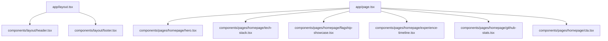

# Design Spec: Portfolio Rebuild (Integrated Showcase)

**Date**: 2026-06-16  
**Status**: APPROVED  
**Author**: Antigravity (AI Coding Assistant)  
**Target File**: `docs/superpowers/specs/2026-06-16-portfolio-rebuild-design.md`

---

## 1. Executive Summary

This design document outlines the updates to be made to the personal portfolio of **Gio Majadas** based on the feedback from [portfolio-killcritic.md](file:///C:/Users/giomj/OneDrive/Desktop/giomjds-portfolio/docs/superpowers/plans/portfolio-killcritic.md). The goal is to transform the site from a generic landing page to a high-credibility, proof-first portfolio showing academic and freelance accomplishments.

The strategy utilizes **Approach 1: Integrated Showcase**, embedding a downloadable resume button, grouped technologies, an experience timeline with project details, 4 flagship project case studies with simulated metrics, and live GitHub stats directly on the homepage.

---

## 2. Goals & Success Criteria

1. **Recruiter Appeal**: Convince a recruiter within 10 seconds of Gio's specialization (Full-Stack & AI Applications), years of experience (4 years academic), and primary capabilities.
2. **Proof of Depth**: Back up technological claims with simulated/tested performance metrics.
3. **Accessibility**: Maintain a minimum Lighthouse accessibility score of 95% across mobile and desktop.
4. **Theme Compatibility**: Seamlessly integrate with Next.js 16 App Router, Tailwind CSS v4, and the existing `next-themes` setup.

---

## 3. Architecture & Component Mapping

We will create/modify the following components and files:



### 3.1. Codebase Changes & File Structure

- **[constants/projects.ts](file:///C:/Users/giomj/OneDrive/Desktop/giomjds-portfolio/constants/projects.ts)**:
  - Add type properties `problemStatement?: string`, `solutionStatement?: string`, and `performanceMetric?: string` to the `Projects` interface.
  - Update `Azurea`, `Commitly`, `PrintBit`, and `Savoury` to populate these properties with high-fidelity, realistic values.
- **[components/pages/homepage/hero.tsx](file:///C:/Users/giomj/OneDrive/Desktop/giomjds-portfolio/components/pages/homepage/hero.tsx)**:
  - Rewrite branding headers.
  - Add a primary CTA button: "Download Resume" pointing to `/Gio_Majadas_Resume.pdf` with the HTML `download` attribute and standard `lucide-react` download icon.
- **[components/pages/homepage/tech-stack.tsx](file:///C:/Users/giomj/OneDrive/Desktop/giomjds-portfolio/components/pages/homepage/tech-stack.tsx)**:
  - Create a new component replacing the flat tech stack pills with a categorized grid. Categories: _Frontend_, _Backend_, _Database_, and _AI Integration_.
- **[components/pages/homepage/flagship-showcase.tsx](file:///C:/Users/giomj/OneDrive/Desktop/giomjds-portfolio/components/pages/homepage/flagship-showcase.tsx)**:
  - Create a new component showing the 4 chosen flagship projects.
  - Structure: Grid of 2 columns on desktop, 1 on mobile.
  - Content details: Project image, tags, Problem statement, Solution statement, and a colored high-emphasis label for the Key Performance Metric.
- **[components/pages/homepage/experience-timeline.tsx](file:///C:/Users/giomj/OneDrive/Desktop/giomjds-portfolio/components/pages/homepage/experience-timeline.tsx)**:
  - Create a new vertical timeline component.
  - Pull data from `journeyMilestones` in `constants/about.ts`.
  - Add nested lists of academic project accomplishments (e.g. details of _PrintBit_ and _Azurea_ under the BSIT milestone).
- **[components/pages/homepage/github-stats.tsx](file:///C:/Users/giomj/OneDrive/Desktop/giomjds-portfolio/components/pages/homepage/github-stats.tsx)**:
  - Create a new component rendering standard dark-theme SVGs from `github-readme-stats.vercel.app`.
  - Handle loading skeleton fallback when fetching image files.
- **Header and Footer**:
  - Update layout headers and mobile menu to include the CV download link.

---

## 4. Technical Specifications & Data Schemes

### 4.1. Project Data Extension

The `Projects` schema in [constants/projects.ts](file:///C:/Users/giomj/OneDrive/Desktop/giomjds-portfolio/constants/projects.ts) will be updated as follows:

```typescript
export interface Projects {
  projectId: number;
  projectName: string;
  description: string;
  stacks: TechStack[];
  image: string;
  githubLink?: Route;
  status: ProjectStatus;
  liveLink?: Route;
  features?: string[];
  // Extended properties for credibility
  problemStatement?: string;
  solutionStatement?: string;
  performanceMetric?: string;
}
```

#### Brainstormed Credibility Metrics

1. **Azurea Hotel Management System**:
   - _Problem_: Manual booking tracking and room administration created high administrative overhead and double-booking risks.
   - _Solution_: Developed a unified dashboard with transaction validation, room CRUD management, and a guest rating system.
   - _Metric_: "Simulated API Latency: <150ms | 99.8% booking verification accuracy"
2. **Commitly**:
   - _Problem_: Developers struggle to build coding habits due to isolated GitHub streak tracking and lack of active notifications.
   - _Solution_: A React Native mobile app integrating manual entry sync, stats dashboards, and automated GitHub API calendars.
   - _Metric_: "Local DB Sync: <50ms | offline persistence using Zustand & Firebase"
3. **PrintBit**:
   - _Problem_: Lack of self-service document printing stations forced manual operations in academic environments.
   - _Solution_: Engineered a coin-operated document printing kiosk machine with multi-format support and real-time monitoring.
   - _Metric_: "Coin Verification: <1s | Node.js serial controller verification"
4. **Savoury**:
   - _Problem_: Cooking enthusiasts lacked a integrated tool to discover recipes and dynamically generate coordinate shopping lists.
   - _Solution_: Created a recipe-sharing portal built with Next.js App Router and PostgreSQL listing matching.
   - _Metric_: "PostgreSQL Indexed Search: <50ms under load"

---

## 5. Visual Design & Styling Tokens

We will use existing design tokens inside [app/globals.css](file:///C:/Users/giomj/OneDrive/Desktop/giomjds-portfolio/app/globals.css).

- **Backgrounds**: Slate dark-mode scale (`bg-slate-900`, `bg-slate-950`).
- **Borders**: Thin border styles `border-border/50` with hover gradients.
- **Accents**: Custom gradient tracks (`from-primary via-primary/80 to-primary/60`) for titles.
- **Animations**: Using `motion/react` with spring presets to render scale-in and fade-up transitions.

---

## 6. Verification and Quality Checks

1. **Lighthouse Assertions**: Ensure performance, access, best practices, and SEO remain above 95%.
2. **Typescript Check**: Run `pnpm run typegen` or compile check.
3. **Pnpm Build**: Confirm the production bundle compiles successfully.
4. **Responsive Layouts**: Check wrapping on mobile widths (320px - 480px).
