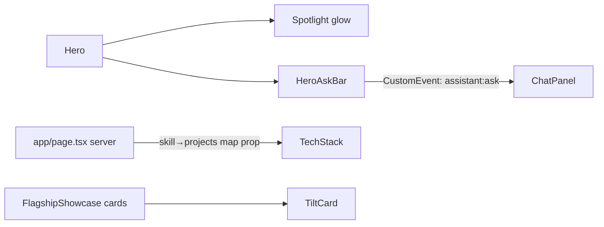

# Homepage Redesign: "Ask My Portfolio" + Depth Polish + Explorable Stack

## Goal Description

The homepage is clean and professional, but it looks like most developer portfolios. The only motion is a fade-up on load. You already own a differentiator that isn't surfaced on the first screen: the AI assistant in [ChatPanel.tsx](file:///D:/giomj/Projects/giomjds-portfolio/components/layout/ChatPanel.tsx).

This plan makes the first screen interactive and memorable without losing professionalism. It has three parts:

1. **Ask-my-portfolio hero.** A prompt bar plus suggestion chips under the headline. Submitting opens the existing assistant with that question. No new AI backend.
2. **Spotlight and depth.** A cursor-following glow in the hero, plus 3D tilt on flagship project cards.
3. **Explorable stack.** Clicking a skill in [tech-stack.tsx](file:///D:/giomj/Projects/giomjds-portfolio/components/pages/homepage/tech-stack.tsx) highlights and lists the real projects that used it. Skills become tied to real work.

Constraints (from AGENTS.md):

- Server Components by default, with `"use client"` only for the new interactive leaves.
- Reuse `components/ui/*`, `cn()`, `@/` imports and `utils/variants.ts`.
- Keep `next.config.ts` untouched.
- Keep the layout shell in `app/layout.tsx`.
- Support dark and light mode.
- Respect `prefers-reduced-motion`.
- Add no new dependencies. `motion` is already installed.
- Invent no metrics, clients or claims. All copy and data come from existing constants.

## User Review Required

> [!IMPORTANT]
> **Scope.** I've split this into three independently shippable phases (A: hero, B: depth, C: stack map). I recommend approving all three, but you can approve only A.
> [!NOTE]
> **Assistant dependency.** The hero prompt bar relies on `/api/assistant/chat`, which needs a Gemini key at runtime. When the key is missing, `ChatPanel` already returns a `missing_api_key` fallback answer. The hero doesn't change that behavior.

## Open Questions

> [!IMPORTANT]
>
> 1. **Hero layout:** keep it centered (default in this plan), or go split with headline left and a live "assistant preview" right?
> 2. **Hero copy:** keep "Full-Stack Developer & AI Application Builder", with a small line above the prompt bar such as "Ask my portfolio anything". OK?
> 3. **Mobile:** the plan shows two suggestion chips on mobile and three on desktop. OK?
> 4. **Optional Phase D (not in scope unless you say yes):** a ⌘K command palette using the existing `ui/command.tsx`, and a thin scroll-progress bar.

## Proposed Changes



---

### Phase A: Ask-my-portfolio hero

#### [NEW] components/pages/homepage/hero-ask-bar.tsx

A client component with one `<form>`.

- Uses `Input` and `Button` from `components/ui`, with a visible-to-screen-reader `<label>` ("Ask the portfolio assistant").
- Chips come from a small constant (the same wording as `getStarterPrompts('/')`), for example "Which projects are best to review first?" and "What are the highlighted skills?".
- On submit or chip click, it dispatches `window.dispatchEvent(new CustomEvent('assistant:ask', { detail: { message } }))`, then clears the input.
- Keyboard: Enter submits. Chips are real `<button>`s with a 44px minimum target.
- Visuals: glass pill (`bg-card/60 backdrop-blur border-primary/30`), a Sparkles icon, and a focus ring using the design tokens. Entrance uses the existing `fadeInUpVariants`.

#### [MODIFY] components/layout/ChatPanel.tsx

Minimal, surgical change: listen for the event and open the panel.

```tsx
// refs so the listener always sees the latest sendMessage
const sendRef = useRef(sendMessage);
useEffect(() => {
  sendRef.current = sendMessage;
});

useEffect(() => {
  function onAsk(e: Event) {
    const message = (
      e as CustomEvent<{ message?: string }>
    ).detail?.message?.trim();
    if (!message) return;
    setIsOpen(true);
    void sendRef.current(message);
  }
  window.addEventListener('assistant:ask', onAsk);
  return () => window.removeEventListener('assistant:ask', onAsk);
}, []);
```

The existing streaming, typing effect and safety flags are untouched. Calls made while `isLoading` are already ignored by `sendMessage`.

#### [MODIFY] components/pages/homepage/hero.tsx

- Insert `<HeroAskBar />` between the paragraph and the CTA buttons.
- Demote the CTAs so there is one visual primary: "View My Work" stays primary, and "Get in Touch" and "Download Resume" become `ghost` or `outline`.
- Replace the plain tech pills with a slow, pausable marquee (CSS transform only, paused on hover, static when reduced-motion is set).

#### [MODIFY] components/pages/homepage/index.ts

Export the new components.

---

### Phase B: Spotlight and depth

#### [NEW] components/ui/spotlight.tsx

A client wrapper that:

- Tracks `pointermove` and writes `--mx` and `--my` CSS variables with rAF throttling.
- Renders an absolutely positioned `radial-gradient(...)` layer using `bg-primary/10`, `pointer-events-none` and `aria-hidden`.
- Is disabled when `(pointer: coarse)` or `prefers-reduced-motion: reduce` is set.
- Animates only `opacity` and `transform`/gradient position (no layout properties).

#### [NEW] components/ui/tilt-card.tsx

A wrapper that applies a subtle tilt of up to 6° via `useMotionValue`, `useSpring` and `useTransform` from `motion/react`, with `perspective`. It has a no-op fallback for touch and reduced motion, and it never traps focus or changes tab order.

#### [MODIFY] components/pages/homepage/hero.tsx

Wrap the hero section content in `<Spotlight>`.

#### [MODIFY] components/pages/homepage/flagship-showcase.tsx

Wrap each project card in `<Tilt>`. I will read this file in full before editing. The card markup stays the same.

#### [MODIFY] app/globals.css

Add a `@keyframes marquee` and a `.marquee` utility. Add a `@media (prefers-reduced-motion: reduce)` override that stops it.

---

### Phase C: Explorable stack

#### [MODIFY] app/page.tsx (server)

Build `skillProjects: Record<string, { id: number; name: string }[]>` from `getProjects()`. It matches `Projects.stacks[].name` against `skills[].name`, case-insensitively. Pass it as a prop to `<TechStack skillProjects={…} />`. Only the small derived map reaches the client, not the full project descriptions.

#### [MODIFY] components/pages/homepage/tech-stack.tsx

- Turn each skill `Card` into a `<button aria-pressed>`. Selecting one sets `selected`, and the others dim to `opacity-40` through `cn()`.
- Below the grid, an `aria-live="polite"` panel lists the linked projects as `Link`s to `/projects/[id]`. If none exist, it shows "No featured project uses this yet." and nothing is made up.
- Add a "Clear" action. `Escape` also clears the selection.
- Without JS or interaction, the section looks the same as today.

---

## Verification Plan

### Automated Tests

There is no test script in `package.json` and none is added. The AGENTS.md gates are:

```powershell
pnpm lint
pnpm build
```

### Manual Verification

- **Hero:** type a question and press Enter. The panel opens and streams an answer. Clicking a chip does the same. With the key missing, the fallback message appears.
- **Keyboard:** Tab reaches the input, chips, skill buttons and CTAs in visual order, with visible focus rings. Escape closes the panel and clears a skill selection.
- **Motion:** with OS "reduce motion" on, the spotlight, tilt and marquee are off and content is still readable.
- **Touch and mobile (375px):** no horizontal scroll, no spotlight or tilt, tap targets are at least 44px.
- **Theme:** check contrast in light, dark and system modes.
- **Performance:** check there is no CLS from the hero changes and that the scroll feels smooth. Check Lighthouse accessibility.
- **Stack map:** clicking "Next.js" lists only projects whose `stacks` contain Next.js, and each link opens the right detail page.
